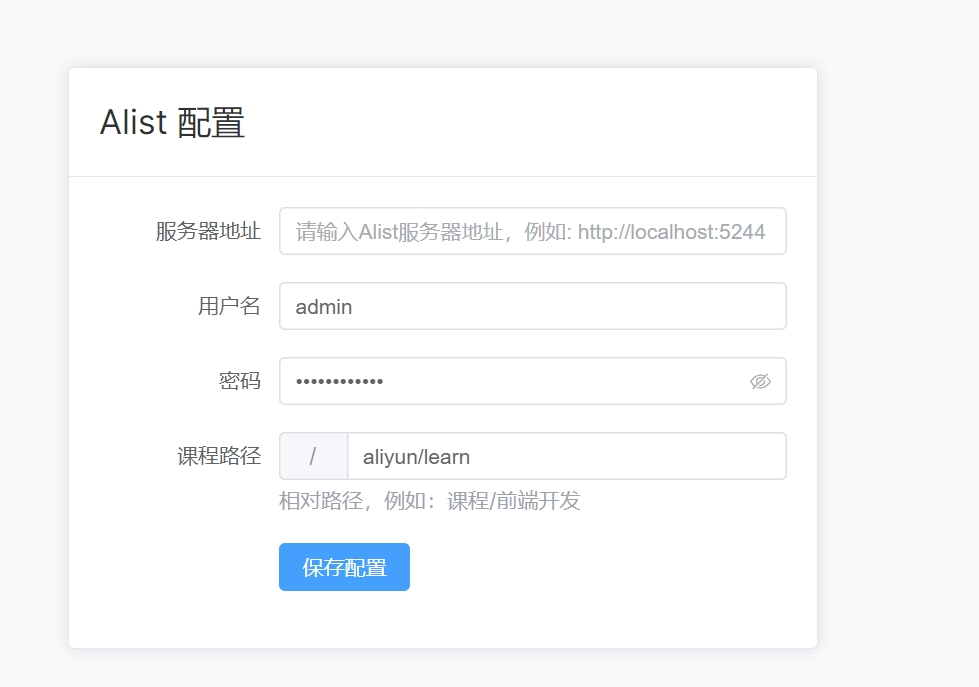
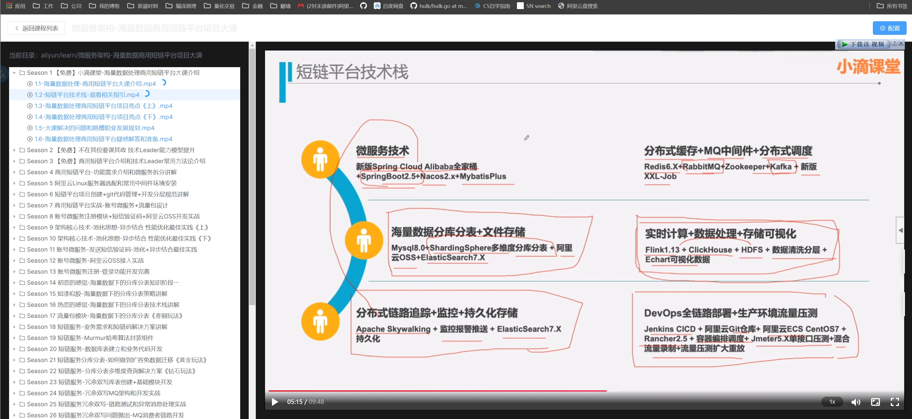
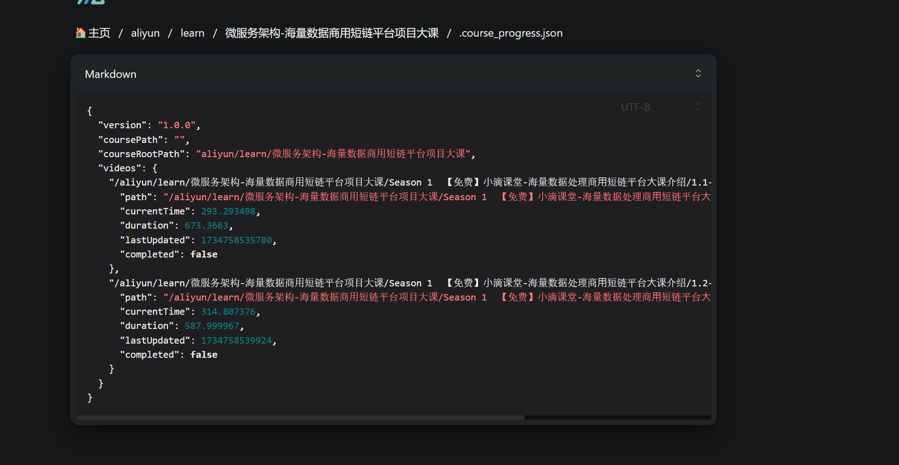

# Alist Course Plugin

[中文](README_zh.md)

An online course video player plugin based on Alist, supporting course directory browsing, video playback, and progress tracking.

Got tired of using Emby for courses, so I made this.

## Features

- 🎯 Tree-style course directory display
- 🎬 Online video playback
- 📝 Automatic progress tracking
- 🔄 Resume playback support
- 📱 Responsive layout design
- 🔒 Alist authentication support

## Tech Stack

- Vue 3
- TypeScript
- Alist API
- artplayer

## Quick Start

### Install Dependencies

```bash
npm install
```

### Run Development Environment

```bash
npm run dev
```

### Build Production Version

```bash
npm run build
```

## Configuration Guide

First-time users need to configure the following:

1. Alist server address
2. Alist access token
3. Course root directory path

These can be set through the configuration button in the top right corner.

## Directory Structure Requirements

Course files should be organized in Alist as follows:

```
Course Root/
  ├── Course1/
  │   ├── Chapter1/
  │   │   ├── Video1.mp4
  │   │   └── Video2.mp4
  │   └── Chapter2/
  └── Course2/
```

## Preview

[Live Demo](https://www.ztianzeng.com/alist-course-plugin/)







