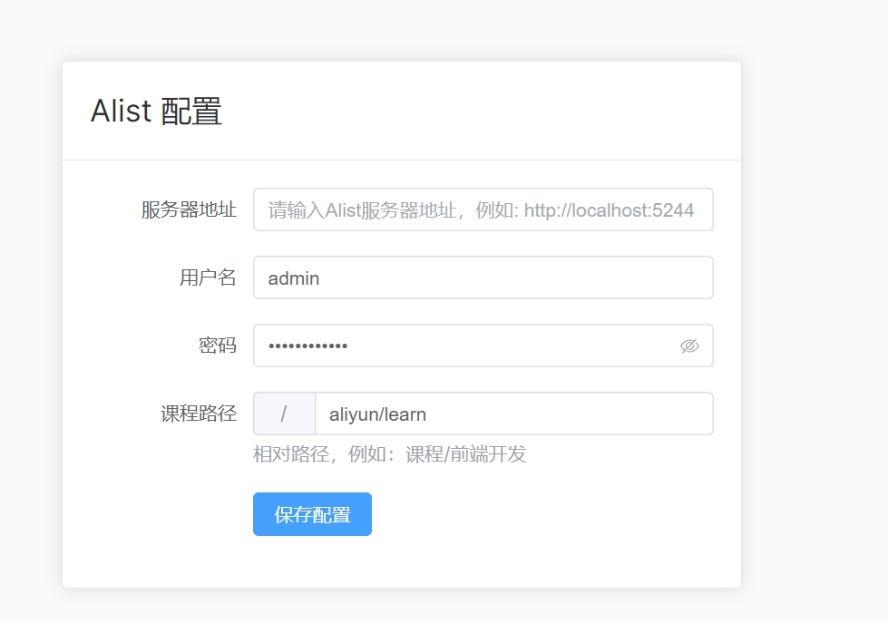
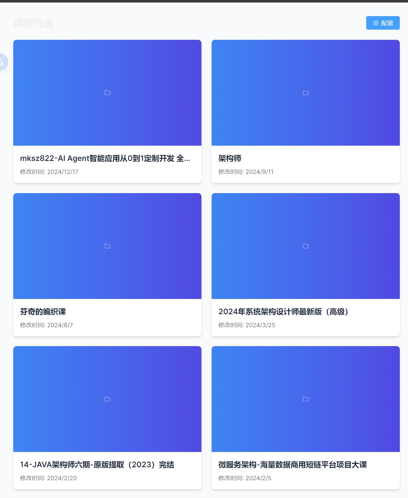
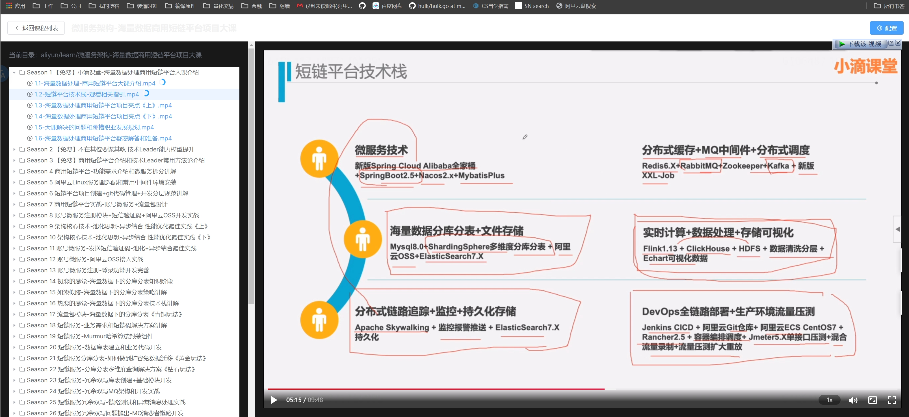

# Alist Course Plugin

一个基于 Alist 的在线课程视频播放器插件，支持课程目录浏览、视频播放和进度记录等功能。

受够了使用emby看课程，所以自己写一个。

## 功能特点

- 🎯 课程目录树形展示
- 🎬 在线视频播放
- 📝 自动记录播放进度
- 🔄 断点续播支持
- 📱 响应式布局设计
- 🔒 支持 Alist 认证

## 技术栈

- Vue 3
- TypeScript
- Alist API
- artplayer

## 快速开始

### 安装依赖

```bash
npm install
```

### 开发环境运行

```bash
npm run dev
```

### 构建生产版本

```bash
npm run build
```

## 配置说明

首次使用需要配置以下信息：

1. Alist 服务器地址
2. Alist 访问令牌
3. 课程根目录路径

可以通过界面右上角的配置按钮进行设置。

## 目录结构要求

课程文件需要按照以下结构在 Alist 中组织：

```
课程根目录/
  ├── 课程1/
  │   ├── 章节1/
  │   │   ├── 视频1.mp4
  │   │   └── 视频2.mp4
  │   └── 章节2/
  └── 课程2/
```

## 运行效果

[在线预览](https://www.ztianzeng.com/alist-course-plugin/)








